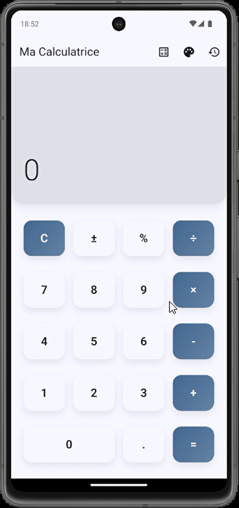

# 📱 Flutter Calculator

A **modern and elegant calculator** built with Flutter, featuring advanced functions, customizable themes, and a smooth user experience.

<p align="center">
  
</p>

---

##  Features

###  Basic Calculator
- Arithmetic operations: `+`, `-`, `×`, `÷`
- Negative numbers with `±`
- Percentage calculation with `%`
- Decimal number support
- Clear button `C`

###  Scientific Mode
- **Trigonometric functions**: `sin`, `cos`, `tan`
- **Math functions**: `√` (square root), `x²` (square), `1/x` (inverse)
- **Constants**: `π` (pi)
- Degree/Radian toggle for trig functions
- Compact mode with collapsible scientific panel

###  Customizable Themes
- **Classic**: Clean & professional
- **Dark**: Perfect for night use
- **Neon**: Cyberpunk-inspired, colorful style
- **Pastel**: Soft and calming
- **Material 3**: Dynamic modern design
- **Persistence**: Saves your preferred theme

###  History
- Automatic save of all calculations
- Dedicated interface to browse history
- History persistence across sessions
- Clear option to delete history

###  Performance & UX
- Optimized for **fast and simultaneous inputs**
- Smooth modern animations & transitions
- Haptic feedback (vibrations)
- Responsive UI for all screen sizes

---

##  Tech Stack
- **Flutter** – Cross-platform framework
- **Dart** – Programming language
- **Provider** – State management
- **SharedPreferences** – Data persistence
- **Material 3** – Modern design system

---

##  Getting Started

### Prerequisites
- Flutter SDK (>= 3.8.1)
- Dart SDK
- Android Studio / VS Code
- Emulator or physical device

### Installation
```bash
# Clone the project
git clone https://github.com/asvpxvivien/Calculator.git

# Go to the project folder
cd Calculator

# Install dependencies
flutter pub get

# Run the application
flutter run
```
---


